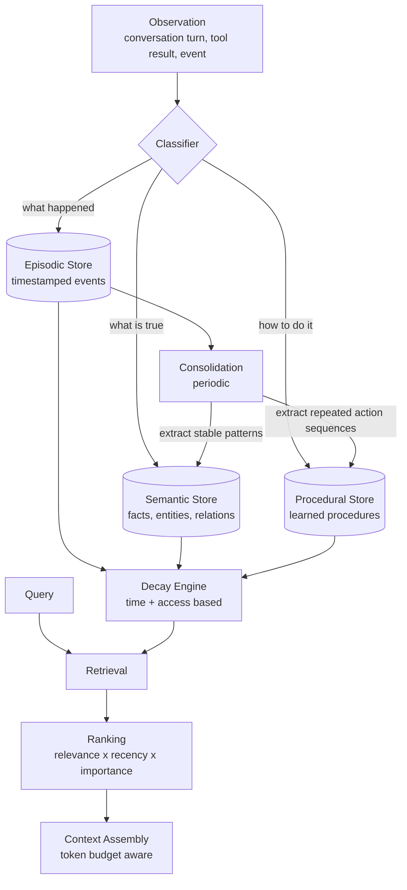

# agent-memory

> Long-term memory for AI agents: episodic, semantic, and procedural stores with temporal decay, importance scoring, consolidation, and explicit relevance-recency trade-offs.

[](https://www.typescriptlang.org/)
[](https://nodejs.org/)
[](LICENSE)
[](#project-status)

## Project Status

**Work in progress.** The three-store memory model, decay and importance scoring, retrieval ranking, and consolidation are implemented. Vector store adapters and the summarization backend are in development. No published benchmarks.

## Problem

Stuffing conversation history into the context window is not memory, it is a buffer. It fails in specific ways:

- **It forgets by truncation, not by relevance.** The oldest message is dropped regardless of whether it was the most important thing the user ever said.
- **Everything competes for the same space.** A stable fact ("the user's database is PostgreSQL") occupies the same budget as a throwaway line from twenty turns ago.
- **There is no notion of importance.** "My name is Marcio" and "ok thanks" get identical treatment.
- **Recall degrades as history grows.** More context is not more useful context, and long contexts measurably dilute attention.

Human memory does not work like a ring buffer. It separates *what happened* from *what is true* from *how to do things*, decays unused traces, and consolidates repeated experience into general knowledge. This library models that structure.

## Memory Model



### The Three Stores

| Store | Holds | Example | Decays |
|-------|-------|---------|--------|
| **Episodic** | Timestamped events, specific to a moment | "On Aug 14 the user reported the deploy failed with error E4021" | Fast |
| **Semantic** | Facts and relations, time-independent | "The user's stack is Next.js on Vercel" | Slow |
| **Procedural** | Action sequences that worked | "To deploy: run tests, build, then `vercel --prod`" | Very slow, strengthens with use |

The split matters because these have genuinely different lifetimes. An episode is usually irrelevant a month later. A fact about the user's stack is relevant until it changes. A procedure that worked should get *stronger* each time it is reused, not weaker.

## Core Mechanics

### Temporal Decay

Memory strength decays exponentially with time since last access:

```
strength(t) = strength₀ · e^(-λ · Δt)

where λ = ln(2) / halfLife
```

Using a half-life parameterization instead of a raw rate constant means the config is interpretable: `halfLife: 7 days` means a memory at strength 1.0 sits at 0.5 after a week untouched. A raw lambda of `0.099` tells you nothing.

Each store gets its own half-life, which is the mechanism that implements the lifetime differences in the table above.

### Access Reinforcement

Retrieving a memory strengthens it, with diminishing returns:

```
strength' = min(1, strength + α · (1 - strength))
```

This is deliberately sub-linear. Linear reinforcement would let a memory retrieved fifty times become permanently pinned, crowding out newer information. The `(1 - strength)` factor means each retrieval adds less than the last, asymptotically approaching 1 without reaching it.

The pattern is borrowed from spaced-repetition literature: retrieval practice strengthens traces, and the effect saturates.

### Importance Scoring

Not every observation deserves equal persistence. Importance is scored at write time from signals that are cheap to compute:

| Signal | Rationale |
|--------|-----------|
| Explicit user emphasis ("remember that", "important:") | Direct instruction, highest weight |
| Novelty vs. existing memories | Redundant information is less worth storing |
| Entity density | Mentions of specific people, systems, or identifiers tend to matter |
| Emotional or urgency markers | Correlates with significance in practice |
| Corrections of prior memories | A correction is always more important than what it replaces |

Importance acts as a floor on decay: a high-importance memory decays from a higher starting strength and is protected from eviction longer.

### Retrieval Ranking

The central trade-off in agent memory is relevance against recency. Pure semantic similarity returns a perfectly relevant fact from six months ago that has since been superseded. Pure recency returns the last thing said regardless of whether it answers the question.

```
score = w_r · relevance + w_t · recency + w_i · importance + w_s · strength
```

Weights are configurable per query type, because the right balance is task-dependent. "What did we decide last week?" wants recency. "What database does the user use?" wants relevance and stability.

### Consolidation

Periodically, the episodic store is scanned for patterns worth promoting:

1. **Repeated facts** across multiple episodes are extracted into a single semantic memory. Ten episodes mentioning PostgreSQL become one fact, and the episodes can then decay freely.
2. **Repeated action sequences** that ended in success become procedural memories.
3. **Contradictions** are surfaced rather than silently resolved. If episodes disagree about a fact, the newer one wins but the conflict is recorded, because silently overwriting is how agents end up confidently wrong.

This is the mechanism that keeps the episodic store from growing without bound while retaining what it taught.

## Installation

```bash
npm install @q1-digital/agent-memory
```

## Quick Start

```typescript
import { AgentMemory } from '@q1-digital/agent-memory';

const memory = new AgentMemory({
  agentId: 'support-agent-1',
  store: {
    provider: 'qdrant',
    url: process.env.QDRANT_URL!,
    collection: 'agent_memory',
  },
  embedding: {
    provider: 'openai',
    model: 'text-embedding-3-small',
  },
  decay: {
    episodic: { halfLifeDays: 7 },
    semantic: { halfLifeDays: 180 },
    procedural: { halfLifeDays: 365, strengthenOnUse: true },
  },
  retrieval: {
    weights: { relevance: 0.5, recency: 0.2, importance: 0.2, strength: 0.1 },
    maxResults: 10,
    minStrength: 0.1,   // Below this, treat as forgotten
  },
  consolidation: {
    enabled: true,
    intervalHours: 24,
    minOccurrencesToPromote: 3,
  },
});

// Write an observation. The classifier routes it to the right store.
await memory.observe({
  content: 'User reported the deploy failed with error E4021 on the staging environment.',
  type: 'auto',              // 'auto' | 'episodic' | 'semantic' | 'procedural'
  metadata: { conversationId: 'c_882', turn: 14 },
});

// Write a fact explicitly, with forced high importance
await memory.observe({
  content: 'The user prefers responses in Brazilian Portuguese.',
  type: 'semantic',
  importance: 0.95,
});

// Recall for a query, budgeted in tokens
const recalled = await memory.recall('what deployment problems has the user had?', {
  tokenBudget: 1024,
  stores: ['episodic', 'semantic'],
});

for (const m of recalled.memories) {
  console.log(m.content, m.score, m.store, m.strength);
}

console.log(recalled.tokensUsed);
console.log(recalled.omittedCount);  // How many relevant memories didn't fit
```

### Recency-Weighted Query

```typescript
const recent = await memory.recall('what did we decide?', {
  weights: { relevance: 0.3, recency: 0.6, importance: 0.1, strength: 0.0 },
});
```

### Inspecting and Correcting Memory

```typescript
// Corrections are first-class: they supersede rather than duplicate
await memory.correct({
  memoryId: 'm_4821',
  newContent: 'The user migrated from PostgreSQL to Supabase in August 2026.',
  reason: 'user stated the migration explicitly',
});

// Surface conflicts that consolidation found but did not silently resolve
const conflicts = await memory.getConflicts();
// [{ fact, candidates: [{ content, source, timestamp }], resolved: false }]

const stats = await memory.stats();
// { episodic: { count, avgStrength }, semantic: {...}, procedural: {...},
//   forgottenLast30Days, consolidationsRun }
```

## Configuration

```typescript
interface AgentMemoryConfig {
  agentId: string;
  store: { provider: 'qdrant' | 'pgvector' | 'memory'; url?: string; collection?: string };
  embedding: { provider: string; model: string };
  decay: {
    episodic: { halfLifeDays: number };
    semantic: { halfLifeDays: number };
    procedural: { halfLifeDays: number; strengthenOnUse?: boolean };
    reinforcementAlpha?: number;   // Default 0.3
  };
  retrieval: {
    weights: { relevance: number; recency: number; importance: number; strength: number };
    maxResults: number;
    minStrength: number;
  };
  consolidation?: {
    enabled: boolean;
    intervalHours: number;
    minOccurrencesToPromote: number;
  };
}
```

## Project Structure

```
src/
├── core/
│   ├── memory.ts                  # Public API: observe, recall, correct
│   ├── classifier.ts              # Routes observations to stores
│   └── config.ts                  # Zod schemas + validation
├── stores/
│   ├── base.store.ts              # Store interface
│   ├── episodic.store.ts          # Timestamped events
│   ├── semantic.store.ts          # Facts and relations
│   └── procedural.store.ts        # Action sequences
├── scoring/
│   ├── decay.ts                   # Exponential decay with half-life
│   ├── importance.ts              # Write-time importance signals
│   ├── reinforcement.ts           # Sub-linear access strengthening
│   └── ranking.ts                 # Weighted multi-factor ranking
├── consolidation/
│   ├── consolidator.ts            # Episodic -> semantic/procedural
│   ├── pattern-extractor.ts       # Repeated fact + sequence detection
│   └── conflict-detector.ts       # Contradiction surfacing
├── assembly/
│   └── context-builder.ts         # Token-budgeted context assembly
└── index.ts
```

## Design Decisions

**Why half-life instead of a decay rate?** `halfLifeDays: 7` is immediately interpretable by anyone configuring the system. `lambda: 0.099` requires doing algebra to understand what it will do. Same math, vastly better ergonomics.

**Why sub-linear reinforcement?** Linear strengthening creates permanent memories after enough retrievals, which turns the memory store into a cache that never evicts its earliest entries. Diminishing returns keeps frequently-used memories strong without making them immortal.

**Why three separate stores instead of one with a type tag?** Because they need different decay curves, different retrieval defaults, and different consolidation behaviour. A type tag on a single store would end up branching on that tag in every code path, which is a store split written badly.

**Why surface conflicts instead of resolving them?** Silent resolution is how an agent becomes confidently wrong. If two sources disagree about a fact, that disagreement is information, and the correct behaviour is often to ask rather than guess.

**Why cap recall by token budget rather than result count?** Ten short memories and ten long ones consume wildly different context. The budget the caller actually has is tokens, so that is the unit the API should accept. `omittedCount` exists so the caller knows recall was truncated rather than exhausted.

## Roadmap

- [ ] Vector store adapters (Qdrant, pgvector)
- [ ] LLM-backed consolidation with summarization
- [ ] Graph relations in the semantic store for multi-hop recall
- [ ] Memory sharing across agents with access control
- [ ] Forgetting audit log (what was dropped and why)
- [ ] Benchmark suite for recall quality over long horizons

## License

MIT
